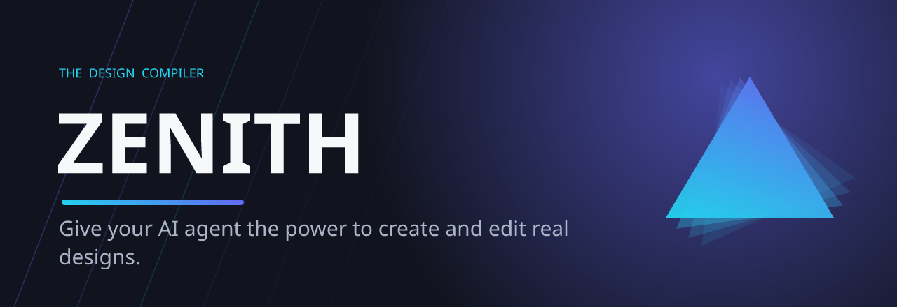
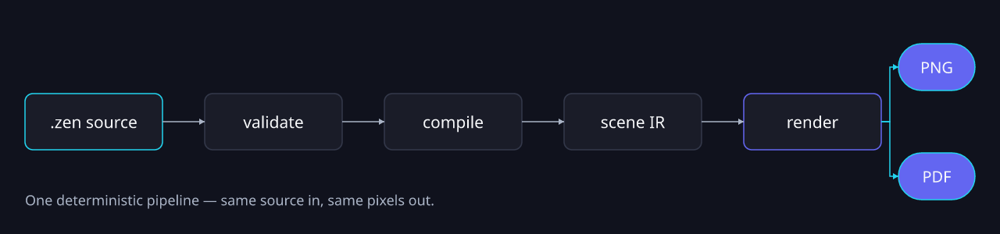
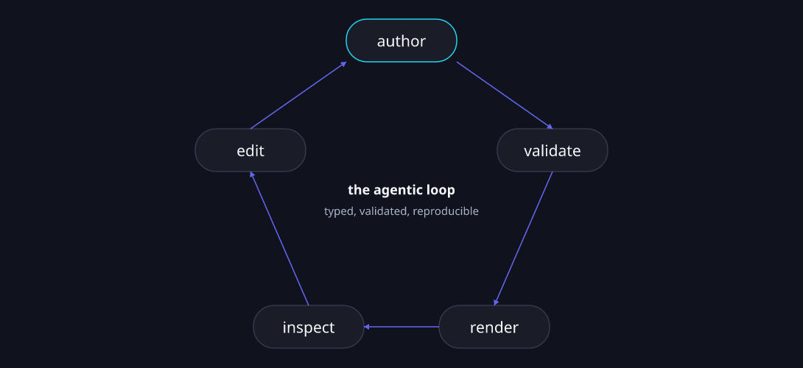
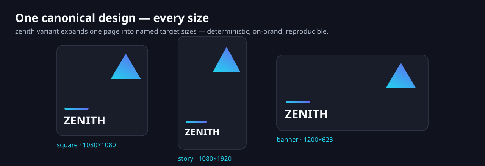

<div align="center">

# Zenith



<h3>A design-document format and engine built for the age of AI agents.</h3>

<p>
Plain-text <strong>.zen</strong> design files that you can read, diff, review, validate, and let an agent safely edit — compiled <strong>deterministically</strong> to pixel-exact PNG and print-ready PDF.
</p>

<p>
  <a href="#install"><strong>Install</strong></a> 
  <a href="#quick-start"><strong>Quick start</strong></a> 
  <a href="#what-it-does"><strong>Features</strong></a> 
  <a href="#validation--the-safety-net"><strong>Validation</strong></a>
  <a href="#command-surface"><strong>Commands</strong></a> 
  <a href="#use-with-your-coding-agent"><strong>Agents</strong></a>
</p>

<p>
  <a href="https://github.com/zenitheditor/zenith/actions/workflows/ci.yml"></a>
  <a href="https://github.com/zenitheditor/zenith/releases"></a>
  <a href="https://crates.io/crates/zenith-tool"></a>
  <a href="https://crates.io/crates/zenith-tool"></a>
  <a href="https://registry.modelcontextprotocol.io/v0/servers/io.github.zenitheditor%2Fzenith/versions/latest"></a>
  <a href="https://github.com/zenitheditor/zenith-showcase"></a>
  <a href="LICENSE"></a>
</p>

<sub><i>Every banner and diagram in this README is itself created using Zenith — source in <a href="assets/showcase">assets/showcase/</a>.</i></sub>

</div>

---

Zenith is a plain-text format and engine for design files — posters, decks, books, social graphics, diagrams, and more. The idea is simple: **design should work the way code does.** You should be able to read it, diff it, review it, test it, and let an agent safely edit it.

A `.zen` file is human-readable [KDL](https://kdl.dev) text. The engine parses it, validates it against a large diagnostic set, compiles it to a backend-neutral scene, and renders the same file to the **same pixels every time** — as a PNG or a print-ready PDF.

> The sections below are collapsed to keep this page skimmable — click any heading's ▸ to expand it. **Install** and **Quick start** are open by default.

## Install

The recommended way to install the `zenith` CLI is the install script, which detects your platform and downloads the matching prebuilt binary from GitHub Releases.

**Linux / macOS**

```bash
curl -fsSL https://raw.githubusercontent.com/zenitheditor/zenith/main/scripts/install.sh | sh
```

**Windows (PowerShell)**

```powershell
irm https://raw.githubusercontent.com/zenitheditor/zenith/main/scripts/install.ps1 | iex
```

Set `ZENITH_INSTALL_DIR` to change the install location (default `~/.local/bin`):

```bash
ZENITH_INSTALL_DIR=/usr/local/bin \
  curl -fsSL https://raw.githubusercontent.com/zenitheditor/zenith/main/scripts/install.sh | sh
```

### With cargo

```bash
cargo install zenith-tool    # from crates.io (installs the `zenith` binary)
cargo install --git https://github.com/zenitheditor/zenith zenith-tool   # from source
```

The library crates (`zenith-core`, `zenith-layout`, `zenith-scene`, `zenith-render`, `zenith-tx`, `zenith-session`) are published under their own names for Rust projects that want to build on the engine directly.

### With npm

```bash
npm install -g @zenitheditor/zenith-mcp
npx -y @zenitheditor/zenith-mcp --help
```

The npm package installs the matching prebuilt `zenith` binary from GitHub Releases and is focused
on the MCP Registry launch path. The unscoped `zenith` binary remains the Rust CLI.

### GitHub Releases

Download directly from [GitHub Releases](https://github.com/zenitheditor/zenith/releases):

| Platform | Architecture  | Asset                                 |
| :------- | :------------ | :------------------------------------ |
| Linux    | x86_64        | `zenith-<version>-linux-x64.tar.gz`   |
| Linux    | aarch64       | `zenith-<version>-linux-arm64.tar.gz` |
| macOS    | x86_64        | `zenith-<version>-macos-x64.tar.gz`   |
| macOS    | Apple Silicon | `zenith-<version>-macos-arm64.tar.gz` |
| Windows  | x86_64        | `zenith-<version>-windows-x64.zip`    |

### Update

```bash
zenith update                   # latest stable release
zenith update --pre             # latest prerelease
zenith update --version <tag>   # a specific release tag, e.g. the ones on the Releases page
```

Verify with `zenith --version`.

### Build from source

For local development or source installs:

```bash
git clone --recurse-submodules https://github.com/zenitheditor/zenith
cd zenith
cargo build --release
cargo install --path zenith-cli   # installs `zenith` to ~/.cargo/bin
./scripts/install.sh --local      # installs the local build to ~/.local/bin
```

The release binary lands at `target/release/zenith`. No C toolchain or system libraries are required — the dependency graph is C-free and `unsafe` is forbidden workspace-wide.

## Quick start

```bash
zenith validate examples/hello.zen          # report diagnostics (add --json for machine output)
zenith fmt examples/hello.zen               # canonical, idempotent formatting
zenith tokens examples/hello.zen            # list design tokens and their resolved values
zenith inspect examples/hello.zen           # print the node tree (read-only)
zenith render examples/hello.zen --out .    # compile + render to PNG

zenith render examples/multipage.zen --all-pages out/     # one PNG per page
zenith render examples/hello.zen --pdf hello.pdf          # print-ready PDF
zenith render examples/hello.zen --scene scene.json       # dump the scene IR
```

The smallest valid document:

```kdl
zenith version=1 {
  project id="proj.hello" name="Hello Zenith"
  tokens format="zenith-token-v1" {
    token id="color.bg" type="color" value="#f8fafc"
    token id="color.ink" type="color" value="#111827"
    token id="font.body" type="fontFamily" value="Noto Sans"
    token id="size.heading" type="dimension" value=(px)42
  }
  styles {}
  document id="doc.hello" title="Hello Zenith" {
    page id="page.hello" w=(px)480 h=(px)160 {
      rect id="rect.bg" x=(px)0 y=(px)0 w=(px)480 h=(px)160 fill=(token)"color.bg"
      text id="text.hello" x=(px)24 y=(px)24 w=(px)432 h=(px)112 fill=(token)"color.ink" font-family=(token)"font.body" font-size=(token)"size.heading" { span "Hello Zenith" }
    }
  }
}
```

See [`examples/`](./examples) for runnable `.zen` files covering shapes, rich text, inline `markdown` (loaded from an external file), code blocks, images, frames/groups, multi-page documents and styles, plus the richer features — `gradient`, `shadow`, `blur`, `filter`, `mask`, `table`, `flowchart` (shapes + connectors), charts (bar/line/area/pie/donut/sparkline, with legends, value labels, and data binding), and `anchors`.

## Why

<details><summary>Code got source control, types, tests, and PRs. Design files got none of that — and that hurts people and blocks AI.</summary>

Code got source control, types, tests, and pull requests. Design files got none of that. They're opaque blobs — you can't diff them, you can't review a change, and the same file can render differently on different machines.

That's a problem for people, and it's a bigger problem for AI. Agents can already write code and open pull requests, because code is text they can read and reason about. Drop them into a design tool and they go blind. Ask an agent to "make the heading brand red and tighten the layout" and there's nothing safe to grab onto — no stable target, no validation, no preview, no way to check the result.

Zenith fixes that. The goal is to make design files as safe to automate as code:

- **Plain text** you own — readable, diffable, yours forever.
- **Stable IDs** so every change is a reviewable patch, not a mouse drag.
- **Deterministic rendering** — the same file always produces the same pixels.
- **Real validation** — text fits, colors come from the design system, nothing falls off the page.
- **Safe edits** — every change is a typed transaction, checked and previewable before it lands, with a source diff and an audit record.

</details>

## It's not AI image generation

<details><summary>The opposite of an image model: Zenith generates the editable <em>design</em>, not a flat picture.</summary>

This is the most common mix-up, so it's worth being blunt: Zenith is the opposite of an image model like Nano Banana, ChatGPT image, or Grok Imagine.

An image generator gives you a flat picture. It's a bag of pixels — you can't open it up and move the logo, you can't force the headline to use your exact brand color, and asking for "the same thing but with a different date" gives you a different image. There's nothing to edit, review, or guarantee.

Zenith doesn't generate a picture. It generates the _design itself_ — a structured, editable document where every element is real and addressable. An agent (or a person) can change one line, swap a color token, or regenerate a hundred on-brand variants, and every render is exact and repeatable. AI writes and edits the source; Zenith guarantees what it means and how it looks.

</details>

## Agent-native first, not a tool with an API bolted on

<details><summary>The foundation is a programmatic, deterministic engine; the visual editor is a client on top — automation is the front door.</summary>

Most design tools are built for a human dragging boxes, and an automation API gets added later as an afterthought — a thin, limited layer over a model that was never meant to be driven by software.

Zenith is built the other way around. The foundation is a programmatic, text-based, deterministic engine. Agents, scripts, and the command line drive it directly. So automation isn't a side door; it's the front door.

**Where this is going.** Today Zenith is the engine and the CLI — the surface an AI agent drives. The roadmap is a **visual editor where humans and AI agents co-edit the same `.zen` documents**: a designer nudges a box, an agent restyles a hundred variants, and both operate on the identical deterministic core with the same validation, transactions, and version history. The GUI is a client on top of the engine — not a separate product with automation bolted on. Agent-first now; **agent + human, together, next.**

</details>

## How it works

<details><summary>One deterministic pipeline: parse + validate → AST → compile → scene IR → render (PNG/PDF).</summary>

A `.zen` document flows through a single deterministic pipeline. Each stage is a separate crate with a clean contract boundary, so a future GPU backend, SVG export, or visual editor consumes the same scene IR:

<p align="center"></p>

<sub><i>Rendered by Zenith — source: <a href="assets/showcase/pipeline.zen"><code>assets/showcase/pipeline.zen</code></a>.</i></sub>

```text
  design.zen  (KDL plain text)
       │  parse + validate           zenith-core   →  diagnostics (Error/Warning/Advisory)
       ▼
  Document AST  ──transaction ops──▶  Document AST'  zenith-tx  →  dry-run / apply + audit record
       │  compile                    zenith-scene + zenith-layout
       │    · resolve tokens, geometry, anchors
       │    · shape text (rustybuzz), wrap, hyphenate
       ▼
  Scene IR  (backend-neutral display list)
       │  render                     zenith-render
       ├─▶ PNG   (tiny-skia, byte-identical)
       └─▶ PDF   (vector, native CMYK, bleed / trim / crop)

  local history / undo / versions    zenith-session   (off the render path; never affects pixels)
```

Everything that touches the render path is **deterministic and C-free**: no time, no randomness, no `HashMap`, no `unsafe`, no C dependencies. The same bytes in always produce the same bytes out, on any machine.

</details>

## What it does

<details><summary>Tokens, a full node set, real typography, visual effects, anchors, recipes, a transaction engine, deterministic PNG/PDF, history, libraries, and data-merge.</summary>

- **Scaffold & identity** — `zenith new` creates a ready-to-edit document (minimal valid template, default `.zen` extension, parent dirs created) with a stable `doc-id` minted on first write; any `.zen` gains its identity and workspace store transparently on the first edit — no manual setup step.
- **Plain-text `.zen` format** — KDL v2 source with `project` / `tokens` / `styles` / `document` / `page` structure; every node carries a stable id.
- **Design tokens** — `color` (sRGB **and** native CMYK), `dimension`, `number`, `fontFamily`, `fontWeight`, `gradient` (linear/radial), `shadow`, `filter`, and `mask`, with alias chains and cycle detection.
- **A full node set** — `rect`, `ellipse`, `line`, `polygon`, `polyline`, `text`, `code`, `image`, `frame`, `group`, `pattern`, `shape`, `connector`, `chart`, `instance`, `field`, `footnote`, `toc`, and `table`, plus lossless pass-through of unknown nodes for forward compatibility.
- **Real typography** — `rustybuzz` shaping with bundled Noto Sans / Noto Sans Mono, font fallback, Knuth–Liang hyphenation, rich inline spans (bold/italic/underline/strikethrough/highlight/inline-code/link), threaded text flow (chains), drop-caps, tab-leaders, text runaround, and a `font.glyph_missing` diagnostic when a glyph is unavailable.
- **Lean long-form text** — keep the `.zen` small by sourcing body copy from an external `.md`/`.txt` file (`text src="copy/article.md"`) or a data field, and opt into **markdown** (`format="markdown"`) for both inline marks (`**bold**`, `*italic*`, `==highlight==`, `++underline++`, `~~strike~~`, `` `code` ``, `[label](url)`) and full **block structure** — `# headings` (h1–h6), blank-line paragraphs, blockquotes, ordered/unordered lists, fenced code blocks, and `---` rules. Per-role typography (font, size, weight, fill, spacing) is controlled by `block role="h1" …` declarations at document, page, or text scope (cascade: text > page > doc), so the `.zen` owns all layout and styling while the `.md` file stays pure prose. For long-form content that exceeds one box, link multiple `text` nodes with `chain` for manual pagination; a `text.overflow` warning fires when content doesn't fit.
- **Visual effects** — linear & radial gradients, layered shadows, Gaussian blur, feathered masks, 12 Porter-Duff blend modes, opacity cascade, per-corner radius, and image fit / clip-shape / object-position.
- **Anchors** — 9-point placement relative to the page, a safe-zone, the parent container, or a sibling node (precedence: zone > sibling > parent > page), all materializing to explicit, deterministic geometry (absent anchor = byte-identical to hand-placed coordinates).
- **Procedural recipes** — a `recipes` provenance block records how a generated motif was made (kind, seed, generator, params, palette tokens, expanded node ids), inspectable and editable via typed recipe transactions, so procedural visuals stay reproducible and re-tunable.
- **Transaction engine** — a typed op set (set fill/stroke/geometry, add/remove/reparent/group, align/distribute, page ops, token ops, find-replace, pattern detach, and more) applied as **dry-run by default**, with referential-integrity and id-uniqueness enforcement, a source diff, a scene diff, affected node ids, and an audit record.
- **Deterministic rendering** — pixel-exact PNG via tiny-skia and print-ready PDF (native DeviceRGB/CMYK, MediaBox/TrimBox/BleedBox, no embedded timestamps), single page, all pages, or facing-page spreads. The scene IR can be dumped to JSON.
- **Real PDF text, not pictures** — PDF output embeds genuine, selectable / searchable / indexable text (subsetted fonts + ToUnicode) and clickable hyperlinks by default; set `selectable=#false` on a `text`/`code` node to render it as outlines instead. `--embed-full-fonts` embeds whole faces in place of subsets.
- **Local history** — per-document identity (ULID doc-id stamped in the file, ignored by the renderer), an ephemeral session DAG for undo/redo, and a durable content-addressed version store (SHA-256 + DEFLATE) with named versions and restore — entirely off the render path.
- **Workspace scratch candidates** — content-addressed `.zen` snapshots for design exploration, stored alongside history: `scratch new` records a candidate, `scratch list`/`show` review them, `candidate` transitions their lifecycle (draft → selected | rejected), `promote --into <page>` merges a selected candidate into the deliverable, and `finalize` drops the rejected ones. `bundle`/`unbundle` pack the whole per-doc store (history + scratch) into a portable, deterministic `.zenithbundle`.
- **Library subsystem** — embedded preset packs (`@zenith/flowchart`, `@zenith/filters`, `@zenith/masks`, `@zenith/brand-kit`); `library add` materializes an item into a self-contained document with `libraries` + `provenance` tracking. Inspect any item with `zenith library show <pkg>#<item>`.
- **AI-asset provenance** — when an image/illustration from an image model is composed in as an `asset`, Zenith records how it was made: `ai-prompt`, `ai-model`, `ai-provider`, `ai-seed`, `ai-license`, `ai-source-rights`, `ai-safety-status`, `ai-reuse-policy` (alongside the `sha256` content lock). Run `zenith schema asset` for the full field list.
- **Variable-data merge** — `role="data.<column>"` bindings drive CSV mail-merge across text and image columns and multi-page templates, with a per-row JSON report and a byte-reproducible manifest.
- **Self-describing CLI** — `zenith schema` emits the authorable surface (every node kind + its attributes, the transaction op set, token types, and the `page`/`asset`/`document`/`variant`/`diagnostics`/`brand` surfaces) as human text or `--json`, so an agent discovers what it can author from the CLI itself rather than guessing — paired with `zenith validate`'s actionable diagnostics for the fix loop.

</details>

## Validation — the safety net

<details><summary>70+ checks (Error / Warning / Advisory) that catch what's wrong, risky, or off-brand <em>before</em> you render or print.</summary>

`zenith validate file.zen` is the step that makes design files safe to edit and trustworthy to ship. It's like a compiler's type-checker, but for a document: it reads the source and reports everything that is wrong, risky, or off-brand **before** you render or print — so an agent (or you) never has to "render it and eyeball it" to find out something broke.

It runs **70+ checks**, each reported as a diagnostic with a stable code (e.g. `text.overflow`), a human message, the offending node id, and the source location. Every diagnostic has one of three severities:

| Severity     | Meaning                                            | Effect                                                                                 |
| ------------ | -------------------------------------------------- | -------------------------------------------------------------------------------------- |
| **Error**    | A definite problem that would produce wrong output | **Blocks rendering** — `render` refuses and `validate` exits non-zero until it's fixed |
| **Warning**  | A likely problem or risky construct                | Output still produced; worth a look                                                    |
| **Advisory** | Informational note                                 | Never blocks; just FYI                                                                 |

What it actually checks, in plain terms:

- **Structure & references resolve** — every node id is unique and every reference points at something real: token refs, image assets, connector targets, fields, masters/sections (`id.duplicate`, `token.unknown_reference`, `asset.unknown_reference`, `connector.missing_target`). No dangling links, no typos that silently render nothing.
- **Design-system discipline** — visual properties must come from **tokens, not raw hex** (`token.raw_visual_literal`), so a brand change is one edit; it also flags cyclic, mistyped, or unused tokens (`token.cyclic_reference`, `token.type_mismatch`, `token.unused`).
- **Nothing falls off or overflows** — geometry is present and on-canvas, text actually fits its box, children stay inside their frame, and content respects page margins and safe zones (`node.missing_geometry`, `text.overflow`, `text.fit_failed`, `frame.child_overflow`, `margin.violation`, `safe_zone.violation`). Anchors must resolve to a real reference frame (`anchor.unresolved_sibling`, `anchor.cycle`).
- **Readable & print-ready** — text/background contrast is checked against **WCAG 3 (APCA)** (`contrast.low`); colorspace, bleed, and page parity are validated so a PDF is actually printable (`document.invalid_colorspace`, `page.invalid_bleed`).
- **Model integrity** — the newer `variants`, `recipes`, and `provenance` blocks are checked too, so generated/derived work stays consistent (`variant.unknown_source`, `recipe.unknown_palette_token`).

Why it matters:

- **For people** — you catch "the headline ran off the page", "this grey-on-grey is unreadable", "that color isn't a brand token", or "the print file has the wrong colorspace" _before_ exporting, not after.
- **For agents** — `zenith validate --json` is a precise, machine-readable contract. An agent edits the source, validates, and _knows_ whether the change is sound — the safety net that makes hands-off editing trustworthy.

<p align="center"></p>

<sub><i>Rendered by Zenith — source: <a href="assets/showcase/loop.zen"><code>assets/showcase/loop.zen</code></a>.</i></sub>

</details>

## Variants

<details><summary>Two ways to generate many outputs from one design: <code>zenith variant</code> (sizes) and <code>zenith merge</code> (data).</summary>

Two complementary ways to generate many outputs from one design — one varies **size**, the other varies **content**.

<p align="center"></p>

<sub><i>Rendered by Zenith — source: <a href="assets/showcase/variants.zen"><code>assets/showcase/variants.zen</code></a>.</i></sub>

### Size / format variants (`zenith variant`)

Declare a `variants` block and expand one canonical page into many named target sizes (square, story, banner, ad slots) — each written as a native `.zen` page plus a rendered PNG, with optional per-target `override`s (hide/show a node, swap text, change a fill). Source token edits propagate to every variant automatically, and anchored nodes reflow to each size.

```kdl
variants {
  variant id="square" source="page.main" w=(px)1080 h=(px)1080 {
    override node="qr" visible=#false
  }
  variant id="story" source="page.main" w=(px)1080 h=(px)1920 { }
}
```

```bash
zenith variant poster.zen --out-dir out/ --manifest manifest.json
```

Generation is deterministic (same source → byte-identical outputs + manifest, `schema: zenith-variant-manifest-v1`).

### Data mail-merge (`zenith merge`)

One template plus a CSV becomes **one rendered design per row** — for localized posts, personalized graphics, certificates, or campaign variants. Mark the variable text/image nodes with `role="data.<column>"` (the columns are the CSV header), then merge:

```kdl
# in poster.zen — bind the headline to the CSV "name" column:
text id="hero.name" role="data.name" x=(px)60 y=(px)160 w=(px)680 h=(px)90 fill=(token)"color.ink" font-family=(token)"font.body" font-size=(token)"size.heading" { span "Name" }
```

```bash
zenith merge poster.zen people.csv --out-dir out/ --name-by name --manifest manifest.json
```

Every row renders independently and deterministically. `--name-by` names files by a column (`Alice.png`, `Bob.png`); `--manifest` writes a byte-reproducible batch record (template + data hashes and per-row provenance) for CI. Image columns work too — a `role="data.logo"` image node swaps its asset path per row.

</details>

## Connectors

<details><summary>Semantic arrows whose endpoints are <em>derived</em> from their <code>from</code>/<code>to</code> nodes — auto-routing, arrowheads, self-loops, and line jumps.</summary>

A `connector` is a semantic arrow between two nodes. It has **no authored geometry** — you give it a `from` and a `to` node id, and the engine derives both endpoints from those targets' resolved boxes at compile time. Move either box and the connector reroutes automatically; the same source always produces the same path. It is a stroke-only leaf (no fill, no children); a `stroke` color is required for it to render.

- **Endpoint anchoring** — `from-anchor` / `to-anchor` pick where each end attaches on a **nine-point grid**: a horizontal band (`left` / `center` / `right`) optionally combined with a vertical band (`top` / `center` / `bottom`) via a hyphen, e.g. `top-left`, `bottom-center`, `center-right`. A bare token names that edge mid-point (`top` = `top-center`); `mid` / `middle` are synonyms for `center`. The default, `auto`, picks the edge facing the other box.
- **Route modes** (`route=`) — `straight` (default) draws a direct line; `orthogonal` draws a right-angle elbow; `avoid` runs an obstacle-avoiding orthogonal router that bends the path around the other node boxes (falling back to a plain elbow when no clear path exists).
- **Self-loops** — when `from` and `to` name the **same** node, the connector becomes a small loop off one edge (the side taken from the anchor, default `top`).
- **Arrowheads** — `marker-start` / `marker-end` = `arrow` add a filled arrowhead in the stroke color (default `none`); heads orient along the actual routed segment, so they land axis-aligned.
- **Line jumps** — a page-level `line-jumps="arc"` or `line-jumps="gap"` makes connectors hop where they cross: the crossing line gets a small semicircular bump (`arc`) or a broken gap (`gap`) so overlapping arrows read clearly. Deterministic — the horizontal line hops over the vertical one — and it applies to nested connectors too. Absent (`none` / default) renders byte-identically.
- **Styling** — `stroke` (required), `stroke-width`, `opacity`, `rotate`, and a `style` ref, following the same property/style cascade as the other primitives.

```kdl
page id="pg" w=(px)640 h=(px)360 line-jumps="arc" {
  shape id="n.start"  kind="process" x=(px)40  y=(px)150 w=(px)130 h=(px)60 fill=(token)"c.node" stroke=(token)"c.line" { span "Start" }
  shape id="n.end"    kind="process" x=(px)470 y=(px)150 w=(px)130 h=(px)60 fill=(token)"c.node" stroke=(token)"c.line" { span "Finish" }
  shape id="n.block"  kind="process" x=(px)290 y=(px)130 w=(px)70  h=(px)100 fill=(token)"c.block" stroke=(token)"c.blockline" { span "Block" }

  // Auto-routed flow bends around the Block instead of crossing it…
  connector id="e.flow"  from="n.start" to="n.end"    route="avoid" marker-end="arrow" stroke=(token)"c.flow"  stroke-width=(token)"cw"
  // …and where a second connector crosses it, the page's line-jumps hops it.
  connector id="e.cross" from="n.top"   to="n.bottom" marker-end="arrow"               stroke=(token)"c.cross" stroke-width=(token)"cw"
}
```

See [`examples/connector-routing.zen`](./examples/connector-routing.zen) for a complete runnable document.

</details>

## Command surface

<details><summary>Author · render · edit · variants · library · theme · history · agent — every command takes <code>--json</code>.</summary>

Run `zenith <command> --help` for flags (each prints a description and an example). Every command supports `--json` for machine-readable output.

| Group         | Commands                                                                                                  |
| ------------- | --------------------------------------------------------------------------------------------------------- |
| **Author**    | `new` · `validate` · `fmt` · `tokens` · `inspect`                                                         |
| **Render**    | `render` (`--pdf` · `--scene` · `--all-pages` · `--spread` · `--page`)                                    |
| **Edit**      | `tx` (typed transactions, dry-run by default)                                                             |
| **Variants**  | `variant` (one design → many sizes/formats) · `merge` (CSV data mail-merge)                               |
| **Library**   | `library list` · `library add`                                                                            |
| **Theme**     | `theme new` (synthesize a token pack from brand colours)                                                  |
| **History**   | `history` · `undo` · `redo` · `version` · `restore` · `sync`                                              |
| **Workspace** | `scratch new/list/show` · `candidate <status>` · `promote --into <page>` · `finalize` · `bundle/unbundle` |
| **Agent**     | `plugin install` · `plugin uninstall` · `plugin list` · `mcp`                                             |

</details>

## History & versions

<details><summary>Local, per-document edit history (snapshots, undo/redo, durable named versions) — entirely off the render path.</summary>

Zenith keeps a **local edit history per document**, entirely off the render path — it never
changes the pixels. On the first edit, a document is given a stable identity: a ULID `doc-id`
stamped into the file and ignored by the renderer. From then on, every engine edit (`tx --apply`,
`library add`, an `undo`/`redo`/`restore`) is recorded as a full **snapshot** (state, not an
op-log), so history survives even hand-edits.

```bash
zenith tx poster.zen recolor.json --apply   # an edit — recorded automatically
zenith undo poster.zen                       # step back, rewriting the file in place
zenith redo poster.zen                       # step forward again
zenith history poster.zen                    # list the timeline (--json for tooling)

zenith version poster.zen "launch-v1"        # save a NAMED version, kept indefinitely
zenith restore poster.zen launch-v1          # rewrite the doc to that version
zenith restore poster.zen @head~1            # …or to a revspec: v2, @head~1, @latest:named, a name

zenith sync poster.zen                        # capture an out-of-band change (GUI / hand-edit / git checkout)
```

There are two tiers. **Undo/redo** walk an ephemeral session timeline — fast, local, for
in-progress work. **Named versions** are durable, content-addressed checkpoints (SHA-256 +
DEFLATE) retained until you remove them; `restore` can jump to any of them. `sync` is how an edit
made _outside_ the engine gets folded back in so the history stays complete. History recording is
best-effort: if it can't write, your file still saves — the edit is never blocked.

</details>

## Use with your coding agent

<details><summary>Install a skill for Claude Code / Codex / OpenCode / Cursor / … with <code>zenith plugin install</code>, plus an MCP server for remote/CI.</summary>

Zenith ships a skill that teaches AI coding agents how to drive the CLI — the agentic
author → validate → render → edit loop, design recipes, and the token/brand discipline that
`--help` can't carry. Install it for whatever agents you use:

```bash
zenith plugin install                  # auto-detect installed agents, install for your user
zenith plugin install --claude --codex # choose specific agents
zenith plugin install --all            # every supported agent
zenith plugin install --claude --scope project   # into ./ for one repo
zenith plugin list                     # see what's installed where
```

Claude Code, Codex, and OpenCode get the full folder skill (reference packs, templates, and
themes); other agents (Cursor, Windsurf, Aider, Zed, Gemini, Copilot, Continue, Kiro,
Antigravity) get a single self-contained rule file that points back at the self-documenting
CLI. Writes are idempotent — re-run any time to update, or `zenith plugin uninstall` to remove.

### MCP server (remote / CI / hosted agents)

For agents that discover capabilities through the Model Context Protocol — or for CI and
hosted/SaaS pipelines — Zenith runs as a first-class MCP server. It is **not** a thin CLI
wrapper: tool results are trimmed structured JSON, schema detail is fetched on demand via a
single `zenith_schema` tool (so the model never carries every node/op schema), large or binary
artifacts (renders, big trees, diffs) come back as **resource links** into a content-addressed
store instead of being inlined, and documents are addressable by `doc-id` so agents stop
juggling paths. The full author loop is exposed — `zenith_schema`, `zenith_validate`,
`zenith_inspect`, `zenith_tokens`, `zenith_tx`, `zenith_render`, `zenith_fmt`, `zenith_merge`,
`zenith_theme_new`, plus the scratch/candidate/promote/finalize workspace tools.

Run it over stdio (the default transport):

```bash
zenith mcp
```

Point any MCP-aware client at it:

```json
{
  "mcpServers": {
    "zenith": { "command": "zenith", "args": ["mcp"] }
  }
}
```

…or, for Claude Code: `claude mcp add zenith -- zenith mcp`.

**Remote / hosted serving.** Build with the optional `http` feature and serve native
Streamable-HTTP at a single `/mcp` endpoint (kept behind an opt-in feature so the default build
stays dependency-light and C-free):

```bash
cargo install --path zenith-cli --features http --locked
zenith mcp --http 127.0.0.1:8080
# test it:
curl -s -XPOST http://127.0.0.1:8080/mcp \
  -H 'Content-Type: application/json' \
  -d '{"jsonrpc":"2.0","id":1,"method":"tools/list"}'
```

The workspace store (scratch candidates, version history, rendered resource artifacts) lives
under `$XDG_DATA_HOME/zenith` (`~/.local/share/zenith` by default); set `ZENITH_DATA_DIR` to
relocate it for isolated/hosted deployments.

> **Local agents should prefer the CLI + skill**, not MCP. Running `zenith` directly (taught by
> `zenith plugin install`) is the fastest path when the environment can run the binary. Reach
> for the MCP server when it can't — remote hosts, CI, sandboxes, or hosted/production services
> where you want the full read+write surface behind a protocol. The server is first-class there.

The repo ships a [`server.json`](./server.json) (MCP registry manifest). The manual
**Publish MCP** workflow publishes the matching npm launcher and registry entry for a selected
stable tag (via GitHub OIDC — no registry token needed), so Zenith stays discoverable from MCP
directories and can be launched by clients through `npx -y @zenitheditor/zenith-mcp`.

- MCP Registry name: `mcp-name: io.github.zenitheditor/zenith`

</details>

## Workspace

<details><summary>A 7-crate Rust workspace; <code>zenith-core</code> depends on nothing else in the tree.</summary>

Zenith is a Rust workspace. Each crate owns one concern and exposes a stable contract; `zenith-core` depends on nothing else in the tree.

| Crate            | Responsibility                                                                            |
| ---------------- | ----------------------------------------------------------------------------------------- |
| `zenith-core`    | KDL parser adapter, semantic AST, canonical formatter, tokens, validation, diagnostics    |
| `zenith-layout`  | Text shaping & font metrics (`rustybuzz` + `ttf-parser`); third-party types confined here |
| `zenith-scene`   | Backend-neutral scene IR + compilation (geometry, text wrap, anchors, opacity/clip)       |
| `zenith-render`  | CPU PNG backend (tiny-skia) and vector PDF backend; determinism enforcement               |
| `zenith-tx`      | Transaction op set, apply/dry-run engine, diffs, and the audit-record contract            |
| `zenith-session` | Local-machine doc identity, session DAG, durable versions (content-addressed store)       |
| `zenith-cli`     | `zenith` command-line tool — dispatch, argument parsing, and JSON/human output            |

</details>

## Works in your repo

<details><summary>A `.zen` file is just text — commit it, review it in PRs, render it in CI, roll it back.</summary>

Because a Zenith file is just text, it lives wherever your code lives. Commit it to git. Review design changes in a pull request, side by side with the diff. Render it in CI to catch a broken layout before it ships. Generate variants in a pipeline. Roll back like any other file. Design stops being a separate world you export to and from, and becomes part of the build.

</details>

## Who it's for

<details><summary>AI/agent builders, engineering teams, high-volume producers, and tool builders.</summary>

- **AI and agent builders** who need to generate and edit visuals reliably, not by screenshot-and-pray.
- **Engineering teams** who want design assets in the repo, reviewed in PRs, and built in CI.
- **High-volume producers** — marketing, publishing, localization — who need lots of correct variants.
- **Tool builders** who'd rather build on an open format than a closed cloud API.

</details>

## Showcase

<details><summary>Reusable Zenith examples live in the <code>zenith-showcase</code> submodule.</summary>

The public showcase lives at [`zenitheditor/zenith-showcase`](https://github.com/zenitheditor/zenith-showcase) and is linked here as the [`zenith-showcase`](./zenith-showcase) submodule.

It is the place for reusable Zenith examples: `.zen` source, rendered outputs, visual recipes, actions, filters, backgrounds, posters, flyers, books, magazines, ads, diagrams, presentations, and other generated design work.

Only put files in the showcase if you have the rights to share them and you allow others to reuse the submitted source, outputs, and assets under the declared license. Private, client, portfolio-only, or custom-licensed work should be linked from the showcase's external gallery instead; licensing for external work stays with the owner.

</details>

## Status

Zenith is in its first public release series. The author → validate → edit → render pipeline works end-to-end: parsing, the diagnostic set, the transaction engine, PNG/PDF rendering, local history, the library subsystem, and variable-data merge are implemented and tested. The format, wire types, and command surface may still evolve while the project matures.

## Contributing

See [CONTRIBUTING.md](CONTRIBUTING.md) for how to work on the engine, and [AGENTS.md](AGENTS.md) for the binding repository conventions (the source of truth for both human and agent contributors).

## License

Apache-2.0. See [LICENSE](LICENSE).
